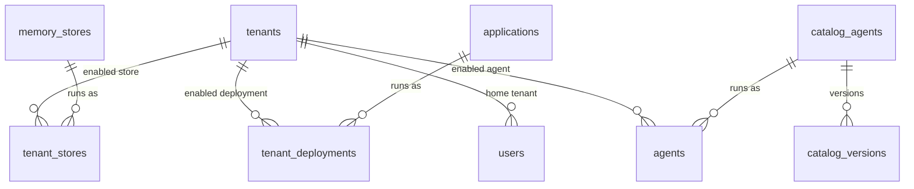

# Data model

Cortex is a control plane over a fleet of customer **tenants**. The database stores
three things:

1. **Who** — the `tenants`, and the `users` who sign in.
2. **A catalog** of three kinds of thing that can run inside a tenant: **agents**,
   **memory stores**, and **deployments**.
3. **What each tenant turned on** — the running instances and their reconcile status.

Everything the catalog touches follows **one lifecycle: author → entitle → enable.**

## Shape

`tenants` sits in the middle. On one side is the **catalog** (`catalog_agents`,
`memory_stores`, `applications`); on the other are the **enabled instances**
(`agents`, `tenant_stores`, `tenant_deployments`) that link a tenant to a catalog
item and carry its live status.

## The one pattern

The three catalog kinds are deliberately identical:

| Kind | Catalog | Entitlement | Enabled instance |
|---|---|---|---|
| **Agent** | `catalog_agents` + `catalog_versions` | `tenants.entitled_agents` | `agents` |
| **Memory store** | `memory_stores` | `tenants.entitled_stores` | `tenant_stores` |
| **Deployment** | `applications` | `tenants.entitled_deployments` | `tenant_deployments` |

- **Author** — create the catalog item. `owner_tenant = ''` = platform-authored
  (shareable); `owner_tenant = <slug>` = authored by a tenant, private to it.
- **Entitle** — add the catalog id to a tenant's `entitled_*` array (platform grant).
- **Enable** — a tenant turns it on, creating the instance row. The in-tenant
  reconciler provisions it and heartbeats status back: `reconciling → live → blocked`.

## Tables

### Identity & tenancy

- **`tenants`** — one row per customer tenant (plus the platform's own,
  `is_platform`). Registry facts (name, Entra directory `tenant_id`, region, plan),
  heartbeat-updated roll-ups (`agent_count`, `monthly_calls`, `drift`, …), and
  runtime facts reported by the reconciler: `cluster_*` (AKS + Argo CD),
  `infra_*` (Lighthouse delegation), `footprint_*` (control-plane-provisioned
  reconciler/Foundry). `enabled` gates all access — new tenants start **disabled**,
  pending platform approval. The `entitled_*` arrays hold catalog grants.
- **`users`** — an Entra identity (`oid` + `tid`) → `role` (`platform` | `tenant`)
  and `tenant_slug`. Written on sign-in.

### Agents

- **`catalog_agents`** — an authored agent: `name`, `type` (`prompt` | `hosted`),
  default `model`, `owner_tenant`.
- **`catalog_versions`** — each published version of a catalog agent: the full
  `definition` (jsonb) and `rollout_percent` (an availability gate, not auto-apply).
- **`agents`** — an agent **enabled in a tenant**: running `version`, `health`,
  `publish_to` targets, optional `memory_store` override.

### Memory stores

- **`memory_stores`** — an authored Foundry memory store: `chat_model` +
  `embedding_model`, which memory kinds it captures (`user_profile_enabled`,
  `chat_summary_enabled`, `procedural_memory_enabled` — typed columns, never a
  blob), and `ttl_seconds`.
- **`tenant_stores`** — a store **enabled in a tenant**: `health`, and `auto`
  (true when it was pulled in automatically by an agent that references it).

### Deployments

- **`applications`** — an authored Helm deployment: `repo_url` / `chart` /
  `target_revision` / `values`, plus optional Azure infra — a `bicep` OCI module
  ref baked (with `bicep_params`) into an `arm_template` that exposes
  `bicep_outputs`; `wiring` maps those outputs → Helm value paths, and `depends_on`
  orders deploys.
- **`tenant_deployments`** — a deployment **enabled in a tenant**: Argo CD
  `sync_status` / `health_status`, `infra_state` + `infra_outputs` (the Bicep the
  control plane provisioned via Lighthouse), and `waiting` (held for unmet deps).

## Conventions

- **One idempotent schema file** — `control-plane/internal/store/schema.sql`,
  applied on every boot (`CREATE TABLE IF NOT EXISTS` + additive
  `ALTER TABLE … ADD COLUMN IF NOT EXISTS`). There is no migration tool.
- **Typed over blob** — definitions are typed columns wherever possible. Only
  genuinely open shapes are `jsonb`: `catalog_versions.definition`,
  `applications.bicep_params` / `wiring`, `tenant_deployments.infra_outputs`.
- **Derived, not stored** — a tenant's lifecycle (from enrollment + heartbeat
  freshness) is computed in Go, not persisted.
- **Ownership vocabulary is shared** — agents, memory stores, and deployments all
  use `owner_tenant` (`''` = platform, else tenant slug) and the same
  `reconciling → live → blocked` instance health.
