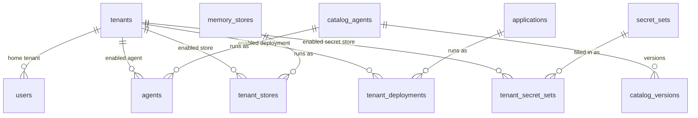

# Data model

Cortex is a control plane over a fleet of customer **tenants**. The database stores
three things:

1. **Who** — the `tenants`, and the `users` who sign in.
2. **A catalog** of the kinds of thing that can run inside a tenant: **agents**,
   **memory stores**, **deployments**, **infrastructure**, and **secret stores**.
3. **What each tenant turned on** — the running instances and their reconcile status.

Everything the catalog touches follows **one lifecycle: author → entitle → enable.**

## Shape

```mermaid
erDiagram
    tenants ||--o{ users              : "home tenant"
    tenants ||--o{ agents             : "enabled agent"
    tenants ||--o{ tenant_stores      : "enabled store"
    tenants ||--o{ tenant_deployments : "enabled deployment"
    tenants ||--o{ tenant_secret_sets  : "enabled secret store"

    catalog_agents ||--o{ catalog_versions   : "versions"
    catalog_agents ||--o{ agents             : "runs as"
    memory_stores  ||--o{ tenant_stores      : "runs as"
    applications   ||--o{ tenant_deployments  : "runs as"
    secret_sets    ||--o{ tenant_secret_sets  : "filled in as"
```

`tenants` sits in the middle. On one side is the **catalog** (`catalog_agents`,
`memory_stores`, `applications`); on the other are the **enabled instances**
(`agents`, `tenant_stores`, `tenant_deployments`) that link a tenant to a catalog
item and carry its live status.

## The one pattern

The catalog kinds are deliberately identical:

| Kind | Catalog | Entitlement | Enabled instance |
|---|---|---|---|
| **Agent** | `catalog_agents` + `catalog_versions` | `tenants.entitled_agents` | `agents` |
| **Memory store** | `memory_stores` | `tenants.entitled_stores` | `tenant_stores` |
| **Deployment** | `applications` | `tenants.entitled_deployments` | `tenant_deployments` |
| **Secret store** | `secret_sets` | `tenants.entitled_secret_sets` | `tenant_secret_sets` |

- **Author** — create the catalog item. `owner_tenant = ''` = platform-authored
  (shareable); `owner_tenant = <slug>` = authored by a tenant, private to it.
- **Entitle** — add the catalog id to a tenant's `entitled_*` array (platform grant).
- **Enable** — a tenant turns it on, creating the instance row. The in-tenant
  reconciler provisions it and heartbeats status back: `reconciling → live → blocked`.

### Secret stores are the one kind that carries a value

Every other kind stores its whole definition here. A secret store deliberately
stores only **key names**, and the values live somewhere this database cannot
reach — the tenant's own Azure Key Vault, created by its footprint.

This works because of an asymmetry in the Azure API that the design leans on
directly:

| Plane | Create a secret | Read its value | Delete it |
|---|---|---|---|
| ARM management (what the control plane can reach) | yes | **no** | **no** |
| Key Vault data plane (what the reconciler can reach) | — | yes | — |

So the control plane accepts a secret from a tenant and puts it beyond its own
reach in the same call. Nothing here — and no platform administrator — can read
it back afterwards. The reconciler reads the values, because it runs inside the
tenant's own subscription and its managed identity holds *Key Vault Secrets User*
on that vault; that is an ordinary same-directory grant, which a vault in the
platform's subscription could not have offered.

Three consequences worth knowing before changing any of this:

- `tenant_secret_sets.keys_set` is the **only** record of what a tenant supplied,
  and it holds names. A key is reported outstanding until it appears there.
- **Disabling does not delete the values.** The control plane has no delete, so
  they stay in the tenant's own vault where only the tenant can remove them.
  Delivery stops: the reconciler removes the Kubernetes Secret.
- A value **never reaches an application's Helm values.** Wiring exposes a secret
  store's `secretName` (the Kubernetes Secret the reconciler writes), and a chart
  reads the value through that. `spec.source.helm.values` is copied verbatim into
  the Argo Application, so anything wireable is effectively public.

**A secret store binds to a Helm chart only — never to a Bicep parameter.** A
parameter value is baked into `arm_template` as a literal and preserved in the
Azure deployment history permanently, readable by anyone with reader access on
the resource group, so there is no safe way to pass one. Infrastructure that
needs a credential should have the module generate it and keep it out of its
outputs. Only an application can depend on a secret store.

## Tables

### Identity & tenancy

- **`tenants`** — one row per customer tenant (plus the platform's own,
  `is_platform`). Registry facts (name, Entra directory `tenant_id`, region, plan),
  heartbeat-updated roll-ups (`agent_count`, `monthly_calls`, `drift`, …), and
  runtime facts reported by the reconciler: `cluster_*` (AKS + Argo CD),
  `infra_*` (Lighthouse delegation), `footprint_*` (control-plane-provisioned
  reconciler/Foundry). `enabled` gates all access — new tenants start **disabled**,
  pending platform approval. The `entitled_*` arrays hold catalog grants.
- **`users`** — an Entra identity (`oid` + `tid`) → `role` (`platform` | `tenant`)
  and `tenant_slug`. Written on sign-in.

### Agents

- **`catalog_agents`** — an authored agent: `name`, `type` (`prompt` | `hosted`),
  default `model`, `owner_tenant`.
- **`catalog_versions`** — each published version of a catalog agent: the full
  `definition` (jsonb) and `rollout_percent` (an availability gate, not auto-apply).
- **`agents`** — an agent **enabled in a tenant**: running `version`, `health`,
  `publish_to` targets, optional `memory_store` override.

### Memory stores

- **`memory_stores`** — an authored Foundry memory store: `chat_model` +
  `embedding_model`, which memory kinds it captures (`user_profile_enabled`,
  `chat_summary_enabled`, `procedural_memory_enabled` — typed columns, never a
  blob), and `ttl_seconds`.
- **`tenant_stores`** — a store **enabled in a tenant**: `health`, and `auto`
  (true when it was pulled in automatically by an agent that references it).

### Deployments

- **`applications`** — an authored Helm deployment: `repo_url` / `chart` /
  `target_revision` / `values`, plus optional Azure infra — a `bicep` OCI module
  ref baked (with `bicep_params`) into an `arm_template` that exposes
  `bicep_outputs`; `wiring` maps those outputs → Helm value paths, and `depends_on`
  orders deploys.
- **`tenant_deployments`** — a deployment **enabled in a tenant**: Argo CD
  `sync_status` / `health_status`, `infra_state` + `infra_outputs` (the Bicep the
  control plane provisioned via Lighthouse), and `waiting` (held for unmet deps).

### Secret stores

- **`secret_sets`** — an authored set of secret **key names** (`keys text[]`).
  There is no column for a value, which is the point rather than an omission.
- **`tenant_secret_sets`** — a set **enabled in a tenant**: `keys_set` (the keys
  a value was supplied for — names only), `vault_uri` (the tenant's own vault the
  values went to), `health`, `detail`, and `auto` (true when it was pulled in by
  an application or infrastructure that depends on it). An auto row is created
  `blocked`, not `reconciling`, because nothing can supply its values but the
  tenant, deliberately.
- **`tenants.vault_name` / `vault_uri` / `vault_id`** — where that tenant's values
  live, recorded from its footprint outputs.

## Conventions

- **One idempotent schema file** — `control-plane/internal/store/schema.sql`,
  applied on every boot (`CREATE TABLE IF NOT EXISTS` + additive
  `ALTER TABLE … ADD COLUMN IF NOT EXISTS`). There is no migration tool.
- **Typed over blob** — definitions are typed columns wherever possible. Only
  genuinely open shapes are `jsonb`: `catalog_versions.definition`,
  `applications.bicep_params` / `wiring`, `tenant_deployments.infra_outputs`.
- **Derived, not stored** — a tenant's lifecycle (from enrollment + heartbeat
  freshness) is computed in Go, not persisted.
- **Ownership vocabulary is shared** — agents, memory stores, deployments,
  infrastructure and secret stores all use `owner_tenant` (`''` = platform, else
  tenant slug) and the same `reconciling → live → blocked` instance health.
