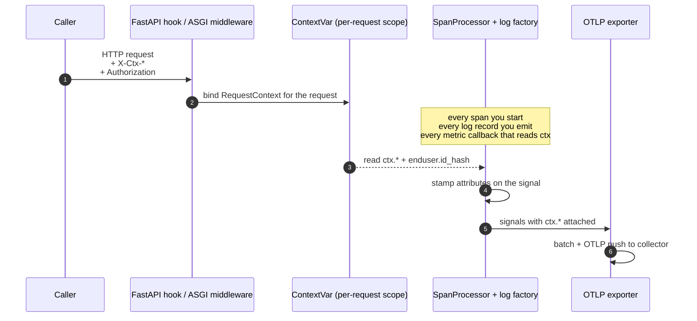

# cortex-otel

Shared OpenTelemetry SDK bootstrap for Cortex Python services.

## New to this? Start here

**What this library does, in one sentence.** It makes every Cortex service label its logs, traces, and metrics the same way so you can search and group them across the platform by tenant, request, workflow, and so on.

**The one concept you need: attributes.** Every log, span, or metric can carry key-value labels called *attributes*, e.g. `ctx.tenant = "acme"`. Attribute keys are dotted strings. Two families exist:

- **Standard OpenTelemetry attributes** (`service.name`, `service.version`, `deployment.environment`, …) — defined by the OTel spec. Don't invent these.
- **Cortex attributes, all prefixed `ctx.`** — defined by us in [ADR-2026-05-19](../../docs/adr/ADR-2026-05-19-full-platform-observability.md). The `ctx.` prefix keeps them clear of the OTel namespace.

The Cortex-defined keys this library binds per request are:

| Attribute | Meaning |
|---|---|
| `ctx.request_id` | Unique id for one inbound request (generated if the caller didn't send one) |
| `ctx.tenant` | Customer/tenant the request belongs to |
| `ctx.app` | Cortex application the request is *for* (`cortex`, `insight`, `inalpha`) |
| `ctx.workflow_id` | Durable workflow the request is part of, if any |
| `ctx.agent_run_id` | Agent run the request is part of, if any |
| `enduser.id_hash` | SHA-256 hash of the JWT `sub` (never the raw id) |

> `enduser.` is an OTel-standard namespace; we only add the `id_hash` sub-key. Everything under `ctx.` is Cortex-defined. Don't assume the two prefixes work the same way.

**How the labels get onto your telemetry.** You call `setup_telemetry(...)` once at startup and install the FastAPI hook (or ASGI middleware). After that, when a request arrives with headers like `X-Ctx-Tenant`, the library binds them on a `ContextVar` for the duration of the request. Every span you open and every log line you write inside that request is stamped automatically. Your job is: bootstrap once, install the hook, and forward the `X-Ctx-*` headers on outbound calls to other Cortex services.

## How the pieces fit together

At runtime the library wires five moving parts around your request path. You install the first two; the rest are installed for you by `setup_telemetry(...)` and run automatically.



1. **Bootstrap once at startup** — `setup_telemetry(...)` installs the tracer/meter providers, the OTLP exporters, the propagator, the `RequestContextSpanProcessor`, and the log-record factory that stamps `ctx.*` on `logging.LogRecord`.
2. **Install the request hook** — `instrument_fastapi(app)` for FastAPI, or `app.add_middleware(RequestContextASGIMiddleware)` for plain ASGI. This is what reads the incoming `X-Ctx-*` headers and calls `_CURRENT.set(...)` on the per-request `ContextVar`.
3. **The span processor reads the ContextVar on every span start** and copies `ctx.*` + `enduser.id_hash` onto the span attributes.
4. **The log factory reads the ContextVar on every log record** and copies the same keys onto the record as fields.
5. **The OTLP exporter batches and ships** the resulting signals to the collector, where you filter and group by any of those attributes.

The important thing to internalise: **the `ContextVar` is the single source of truth for the duration of a request**. Anything you emit inside that scope is stamped. Anything you emit outside it (e.g. a background task you dispatched without propagating context) is not — see [Workers and jobs](#workers-and-jobs-no-http-request) for how to bind the context manually in that case.

## Installation

`cortex-otel` lives in this monorepo and is **not published to PyPI**. Consuming services depend on it as an editable path source via `uv`.

**1. Declare the dependency in your service's `pyproject.toml`.** Pick the extras you need (`fastapi`, `httpx`, `grpc`):

```toml
[project]
dependencies = [
    "cortex-otel[fastapi,grpc]",
    # ...
]

[tool.uv.sources]
cortex-otel = { path = "../../libs/cortex-otel", editable = true }
```

The `../../libs/cortex-otel` path is relative to your service directory (e.g. from `platform-services/authz-service/`), so this shape works for anything at `platform-services/<svc>/` or `services/<svc>/`.

**2. Sync your lockfile.**

```bash
uv sync
```

**3. In your service `Dockerfile`, build from the repo root and copy the library alongside your service source so the relative path resolves inside the image.** The layout inside the image must mirror the repo:

```dockerfile
WORKDIR /build

# Build context is the repo root. Copy the library BEFORE the service pyproject
# so `uv sync` can resolve the ../../libs/cortex-otel path source.
COPY libs/cortex-otel/ ./libs/cortex-otel/
COPY platform-services/<svc>/pyproject.toml platform-services/<svc>/uv.lock ./platform-services/<svc>/
RUN cd platform-services/<svc> && uv sync --frozen --no-dev --no-install-project --no-editable
```

And in your service's build pipeline / `Makefile`, run `docker build` with `-f platform-services/<svc>/Dockerfile .` from the repo root so the build context includes `libs/`.

See [`platform-services/authz-service/pyproject.toml`](../../platform-services/authz-service/pyproject.toml) and [`platform-services/authz-service/Dockerfile`](../../platform-services/authz-service/Dockerfile) for the reference wiring.

## What this library provides

- `setup_telemetry(...)` — idempotent SDK bootstrap. Creates `TracerProvider` + `MeterProvider`, wires OTLP HTTP exporters, sets the W3C TraceContext propagator, registers per-request context processors, and attaches `trace_id` / `span_id` to log records.
- `RequestContextASGIMiddleware` — plain ASGI/Starlette middleware that reads the cross-service header contract and binds `ctx.*` and `enduser.id_hash` for the duration of each HTTP request. **FastAPI services use `instrument_fastapi(app)` instead** — see [Usage](#usage) below.
- `request_context(...)` — context manager for callers that aren't behind an HTTP boundary (workers, scheduled jobs) to bind the same attributes manually.
- `attributes` module — string constants for every ADR-2026-05-19 attribute key. Import and use these instead of raw strings so a typo in one service can't silently split dashboards.
- `instrument_fastapi(app)` — auto-instrument a FastAPI app (optional extra: `cortex-otel[fastapi]`).
- `instrument_httpx_client()` — auto-instrument all `httpx` clients (optional extra: `cortex-otel[httpx]`).
- `instrument_grpc_aio_client()` — auto-instrument outbound async gRPC calls (optional extra: `cortex-otel[grpc]`).

If `otlp_endpoint` (or `OTEL_EXPORTER_OTLP_ENDPOINT`) is unset, `setup_telemetry()` is a no-op apart from log correlation. This lets services keep one bootstrap call in their entrypoint and ship telemetry only when an endpoint is configured (e.g. in-cluster).

## Usage

```python
from cortex_otel import setup_telemetry, instrument_fastapi

def build_app() -> FastAPI:
    # emitter_app is the Cortex application this service belongs to:
    # "cortex" for platform services (authz, tenant-operator, workflow-*, ai-gateway);
    # "insight" or "inalpha" when a service runs as a first-party emitter.
    # Values are lowercase and defined in ADR-2026-05-19.
    setup_telemetry(service_name="authz-service", emitter_app="cortex")

    app = FastAPI()

    # For a FastAPI app this is all you need. instrument_fastapi installs an
    # OTel server_request_hook that reads the X-Ctx-* headers and binds them
    # *before* the root request span opens, so ctx.* lands on the root span,
    # child spans, and any log records emitted during the request.
    #
    # Do NOT also call app.add_middleware(RequestContextASGIMiddleware) — the
    # middleware runs inside the OpenTelemetryMiddleware wrapper and cannot
    # reach the root span. Use the middleware only in plain Starlette/ASGI
    # apps that don't use instrument_fastapi.
    instrument_fastapi(app)
    return app
```

## Header contract

The middleware reads the following request headers. Callers that fan out to
downstream Cortex services must forward these on outgoing requests so
telemetry stays correlated across the full call graph.

| Header                 | Bound attribute       |
|------------------------|-----------------------|
| `X-Request-Id`         | `ctx.request_id` (generated if absent) |
| `X-Cortex-Tenant` (trusted) / `X-Ctx-Tenant` (fallback) | `ctx.tenant` |
| `X-Cortex-App` (trusted) / `X-Ctx-App` (fallback) | `ctx.app` |
| `X-Ctx-Workflow-Id`    | `ctx.workflow_id`     |
| `X-Ctx-Agent-Run-Id`   | `ctx.agent_run_id`    |
| `X-Cortex-Sub` (trusted) / `Authorization: Bearer <jwt>` (fallback) | `enduser.id_hash` = sha256 of the pre-verified subject, or of the JWT `sub` (falls back to Azure AD `oid`); the JWT signature is not verified here — that is the gateway's job |

Trace propagation uses the standard `traceparent` header handled by the OTel
propagator, not by this middleware.

## Trust boundary

`ctx.tenant`, `ctx.app`, and the identity behind `enduser.id_hash` are
security-sensitive — they end up on logs, metrics, and traces that we filter
and alert on per-tenant, so a request that lies about its tenant pollutes
another tenant's dashboards.

At the ingress, the per-tenant Envoy `SecurityPolicy` forwards every request
through the authz-service, which validates the JWT and resolves `tenant` and
`app` from the request hostname (`<app>.<tenant>.cortex.ai`). On allow, it
returns `x-cortex-sub`, `x-cortex-tenant`, and `x-cortex-app` as ext-authz
response headers. Envoy's ext-authz semantics **replace** any same-named
client header before the request reaches the upstream, so those three are the
authoritative identity + tenant + app for every request that came in through
the gateway.

This middleware prefers the trusted `X-Cortex-*` headers over the
client-supplied `X-Ctx-*` counterparts. That way an external caller cannot
spoof `ctx.tenant` or `ctx.app` by setting their own `X-Ctx-Tenant` — the
gateway's value wins.

The `X-Ctx-*` headers are still honoured as a **fallback** so intra-mesh
service-to-service calls (which don't traverse the gateway and therefore don't
pick up the `X-Cortex-*` headers) can still propagate context.

**Residual gap** — internal service-to-service calls that bypass the gateway
(direct `Service` DNS between namespaces) are not authenticated at the mesh
layer today, so a compromised in-mesh workload could still forge `X-Ctx-*`
headers. Closing that gap requires mesh mTLS + identity policy and is tracked
as a follow-up.

## Forwarding context on outbound calls (don't skip this)

When your service calls another Cortex service, OTel auto-propagates the **trace** via `traceparent` (that's what `instrument_httpx_client()` does). It does **not** forward the `ctx.*` values — those are Cortex-specific and the SDK has no idea they exist. If you don't add them yourself, the downstream service's telemetry loses `ctx.tenant`, `ctx.request_id`, and friends, and cross-service queries silently break.

Read the current request's context and turn it into headers:

```python
import httpx
from cortex_otel import current_request_context


def cortex_ctx_headers() -> dict[str, str]:
    rc = current_request_context()
    if rc is None:
        return {}
    mapping = {
        "X-Request-Id": rc.request_id,
        "X-Ctx-Tenant": rc.tenant,
        "X-Ctx-App": rc.app,
        "X-Ctx-Workflow-Id": rc.workflow_id,
        "X-Ctx-Agent-Run-Id": rc.agent_run_id,
    }
    return {k: v for k, v in mapping.items() if v}


async def call_downstream(client: httpx.AsyncClient) -> httpx.Response:
    # instrument_httpx_client() already injects traceparent for trace linking;
    # we add ctx.* on top so the callee's telemetry stays labelled.
    return await client.get(
        "http://tenant-operator/api/thing",
        headers=cortex_ctx_headers(),
    )
```

Rules of thumb:

- **Trace context** (`traceparent`) propagates automatically once you call `instrument_httpx_client()`. You don't touch it.
- **`ctx.*` context** does **not** propagate automatically. Call `cortex_ctx_headers()` on every outbound request to another Cortex service.
- **`enduser.id_hash`** is *not* a forwarded header. Forward the original `Authorization: Bearer <jwt>` header instead and the downstream middleware re-derives the hash. Only do this for calls genuinely on behalf of the end user.

## Workers and jobs (no HTTP request)

Background workers and scheduled jobs have no inbound request, so there are no headers for the middleware to read. Bind the context manually with `request_context(...)` and everything emitted inside the block is stamped the same way:

```python
from cortex_otel import request_context

def process_job(job) -> None:
    with request_context(
        tenant=job.tenant,
        workflow_id=job.workflow_id,
        request_id=job.id,
    ):
        do_the_work(job)  # spans and logs in here carry ctx.tenant, ctx.workflow_id, ctx.request_id
```

Nested `request_context(...)` blocks inherit any field left as `None` from the enclosing block and override the ones you pass explicitly.

## Chart wiring

In a chart template, set:

```yaml
- name: OTEL_EXPORTER_OTLP_ENDPOINT
  value: http://cortex-collector.observability.svc.cluster.local:4318
- name: OTEL_EXPORTER_OTLP_PROTOCOL
  value: http/protobuf
- name: OTEL_RESOURCE_ATTRIBUTES
  value: deployment.environment=local,service.instance.id=$(POD_NAME)
- name: POD_NAME
  valueFrom:
    fieldRef:
      fieldPath: metadata.name
```

`service.name` comes from `setup_telemetry()` arguments; everything else is merged in from `OTEL_RESOURCE_ATTRIBUTES`.

## Scope

This package only bootstraps the SDK. It does not own service-specific metric definitions or span events — those live in each service. See `services/workflow-worker/src/cortex_workflow_worker/telemetry.py` for an example of a service that builds on this base.
